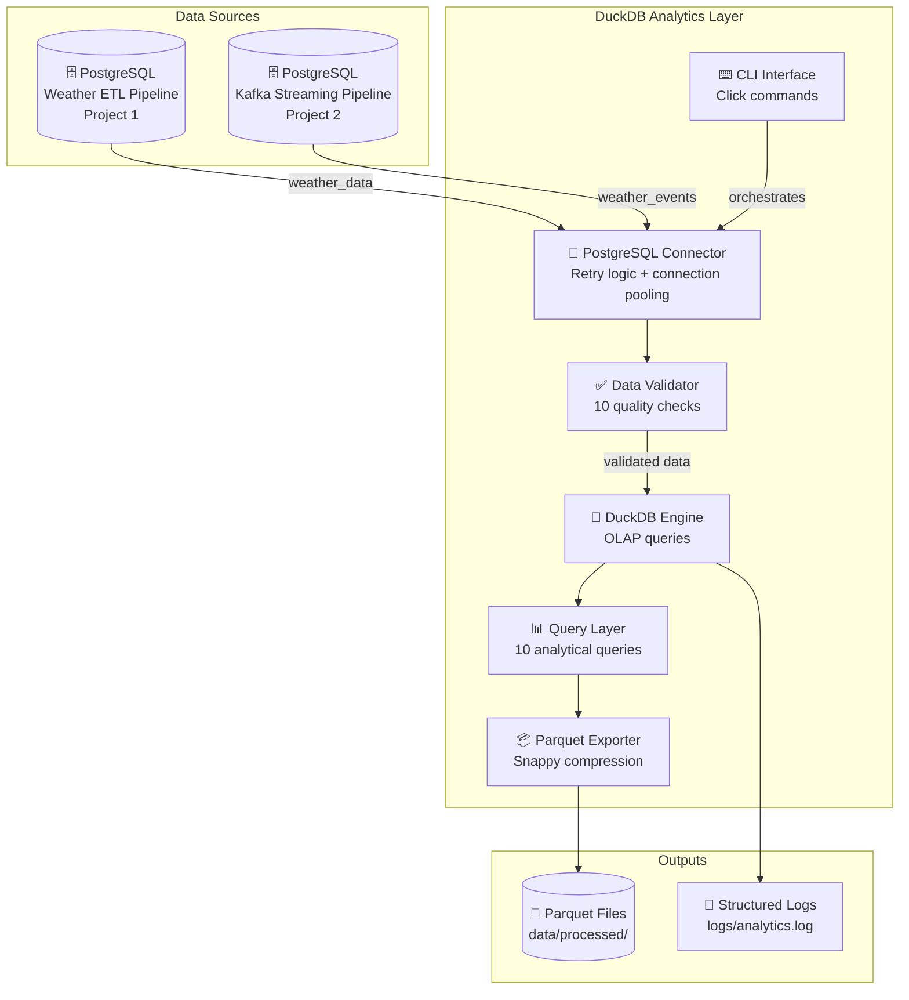

# 🦆 DuckDB Weather Analytics


An analytical layer built on top of the weather data pipelines from Projects 1 and 2. Uses DuckDB as a fast OLAP engine to run 10 analytical queries on weather data collected from PostgreSQL, validates data quality before analysis, exports results to Parquet and provides a CLI interface.

Built as the fourth project in my Data Engineering portfolio to demonstrate the difference between OLTP storage (PostgreSQL) and OLAP analysis (DuckDB), and to show how analytical layers sit on top of data pipelines in production.

---

## 📐 Architecture



### Data Flow

1. **PostgreSQL Connector** loads weather data from Projects 1 and 2 with retry logic
2. **Data Validator** runs 8 quality checks before any analysis begins
3. **DuckDB Engine** loads validated data into memory for fast OLAP queries
4. **Query Layer** runs 10 analytical queries covering temperature, humidity, wind and anomalies
5. **Parquet Exporter** exports results to columnar Parquet files with Snappy compression
6. **CLI Interface** orchestrates the full pipeline with simple commands

---

## 🛠️ Tech Stack

| Layer | Technology | Version | Purpose |
|---|---|---|---|
| Analytical Engine | DuckDB | 1.5.3 | Fast OLAP queries on weather data |
| Data Source | PostgreSQL | 15 | Weather data from Projects 1 and 2 |
| Data Processing | Pandas | 3.0.0 | DataFrame manipulation |
| Export Format | PyArrow | 24.0.0 | Parquet columnar storage |
| CLI | Click | 8.4.1 | Command-line interface |
| Scheduling | APScheduler | 3.11.2 | Hourly analytics runs |
| Templating | Jinja2 | 3.1.6 | HTML report generation |
| Testing | pytest | 9.0.3 | 29 unit tests 

---

## ✨ Key Features

- **10 OLAP analytical queries** — average temperature, city rankings, humidity trends, wind distribution, condition frequency, temperature/humidity correlation, daily range, anomaly detection, pressure trends, feels-like gap
- **8 data quality checks** — empty dataset, required columns, null values, temperature range, humidity range, wind speed range, duplicates, pressure range
- **DuckDB OLAP engine** — queries run in milliseconds on datasets that would be slow in PostgreSQL
- **Parquet export** — results exported to columnar Parquet format with Snappy compression
- **CLI interface** — run analytics, validate data and list exports from the command line
- **Retry logic** — PostgreSQL connector retries 3 times with delay on connection failure
- **Structured logging** — every query, validation and export logged with timing metrics
- **Sample data mode** — run full analytics without PostgreSQL using generated sample data
- **29 unit tests** — covering all 10 queries and all 8 validation checks
- **CI/CD** — GitHub Actions runs tests and full analytics on every push

---

## 📊 Analytics Metrics

| Metric | Value |
|---|---|
| Analytical queries | 10 OLAP queries |
| Data quality checks | 8  validation checks |
| Records analysed | 2,880 records per sample run |
| Cities covered | 12 across 6 continents |
| Average query time | under 30ms per query |
| Export format | Parquet with Snappy compression |
| Unit tests | 29 passing |
| CI status | GitHub Actions — passing |

---

## 📁 Project Structure

```
duckdb-analytics/
│
├── src/
│   ├── connectors/
│   │   └── postgres_connector.py   # PostgreSQL to DuckDB loader with retry logic
│   ├── queries/
│   │   └── weather_queries.py      # 10 analytical OLAP queries
│   ├── exporters/
│   │   └── parquet_exporter.py     # Parquet export via PyArrow
│   └── validators/
│       └── data_validator.py       # 8 data quality checks
│
├── tests/
│   ├── test_queries.py             # 10 query tests with in-memory DuckDB
│   └── test_validator.py           # 19 validator tests with fixtures
│
├── data/
│   ├── raw/                        # Raw exports from PostgreSQL
│   ├── processed/                  # Parquet files
│   └── reports/                    # HTML reports
│
├── .github/workflows/ci.yml        # GitHub Actions — tests + analytics on every push
├── config.py                       # Configuration from environment variables
├── main.py                         # CLI entry point with Click
├── requirements.txt                # Pinned Python dependencies
├── Makefile                        # Shortcuts — make analyse, test, export, clean
├── .env.example                    # Environment variable template
└── README.md
```

---

## 🚀 How to Run

### Prerequisites

- Python 3.11+
- PostgreSQL running with weather data from Project 1 or Project 2 (optional — sample data available)

### Step by step

**1. Clone the repository**

```bash
git clone https://github.com/OjongBessongNKONGHO/duckdb-analytics.git
cd duckdb-analytics
```

**2. Install dependencies**

```bash
pip install -r requirements.txt
```

**3. Configure environment (optional — only needed for real PostgreSQL)**

```bash
cp .env.example .env
# Edit .env with your PostgreSQL credentials
```

**4. Run analytics with sample data**

```bash
python main.py analyse --use-sample
```

**5. Run with real PostgreSQL data**

```bash
python main.py analyse
```

**6. Export results to Parquet**

```bash
python main.py analyse --use-sample --export
```

**7. Run data quality validation**

```bash
python main.py validate --use-sample
```

**8. Run tests**

```bash
python -m pytest tests/ -v
```

Or using Makefile:

```bash
make analyse    # Run analytics with sample data
make validate   # Run data quality validation
make export     # Run analytics and export to Parquet
make test       # Run all 29 tests
make clean      # Remove generated files
```

---

## 🧠 Key Engineering Decisions

**Why DuckDB instead of running queries directly in PostgreSQL?**
PostgreSQL is optimised for OLTP — fast inserts, updates and single-record lookups. Analytical queries with GROUP BY, window functions and aggregations across millions of rows are much faster in a columnar OLAP engine like DuckDB. DuckDB loads data into memory and uses vectorised execution — the same query that takes seconds in PostgreSQL runs in milliseconds in DuckDB.

**Why validate data before analysis?**
If the data has nulls, duplicates or out-of-range values, the analytical results will be wrong. Validating first catches data quality issues early, logs exactly what is wrong and stops bad data from producing misleading insights. This is the fail-fast principle applied to analytics.

**Why export to Parquet?**
Parquet is the industry standard columnar format for data lakes. It compresses data significantly better than CSV, preserves data types and is natively supported by Spark, dbt, BigQuery, Snowflake and every modern data tool. Exporting to Parquet means the results from this analytics layer can feed directly into a downstream Spark or dbt pipeline.

**Why a CLI interface?**
A CLI makes the project usable without writing code. Anyone can clone the repo and run `python main.py analyse --use-sample` immediately. In production, the CLI commands would be called by an Airflow DAG or a cron job, making the analytics layer easy to orchestrate.

---

## 🔗 Portfolio Context

This project is the analytics layer for my data engineering portfolio:

| Project | What it does | Stack |
|---|---|---|
| [Weather ETL Pipeline](https://github.com/OjongBessongNKONGHO/weather-etl-pipeline) | Batch ETL — hourly weather data pipeline | Airflow, PostgreSQL, Docker |
| [Kafka Streaming Pipeline](https://github.com/OjongBessongNKONGHO/kafka-streaming-pipeline) | Real-time streaming — Kafka producer/consumer | Kafka, Pydantic v2, PostgreSQL, Docker |
| [AWS Data Platform](https://github.com/OjongBessongNKONGHO/aws-data-platform) | Cloud infrastructure for the above pipelines | Terraform, AWS, IaC |
| **DuckDB Analytics** (this repo) | Analytical layer on top of pipeline data | DuckDB, Pandas, PyArrow, Click |

---

## 👤 Author

**Ojong Bessong NKONGHO**
Data Engineering Student — DSTI School of Engineering, Paris
Seeking Data Engineering internship (July 2026) and apprenticeship (September 2026)

[](https://linkedin.com/in/nkongho-ojong)
[](https://github.com/OjongBessongNKONGHO)